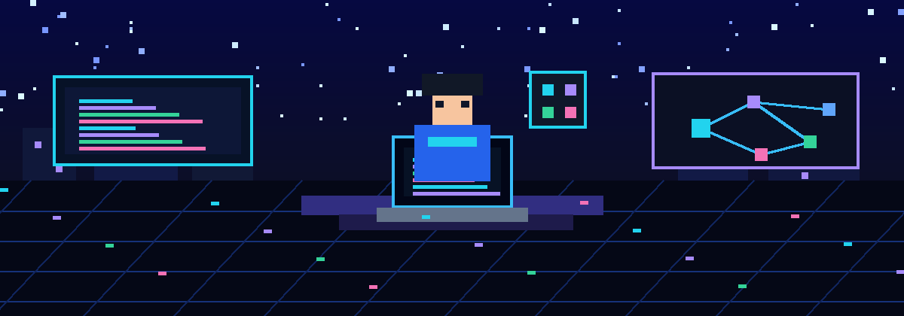
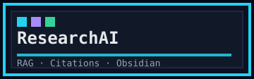
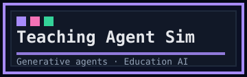
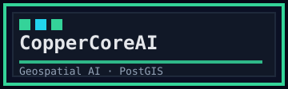
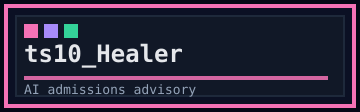
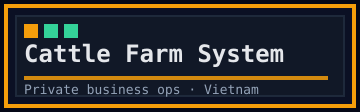
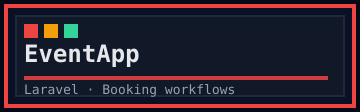
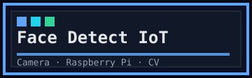

  

  <h1>healerHK</h1>

  

    <b>AI Engineering · Full-Stack Development · Intelligent Systems</b> 
    Building practical software from ambitious ideas.
  

## About me

I'm a dev from the Gen Z generation who enjoys turning ambitious ideas into practical software. My work spans AI engineering, full-stack development, and intelligent systems, with a strong interest in open-source software and trustworthy AI. I believe continuous learning, experimentation, and collaboration are the foundations of meaningful innovation.

> "We are what we repeatedly do. Excellence, then, is not an act but a habit." — Often attributed to Aristotle

## Project tags

  
  
  
   
  
  
  
   
  

> Click a tag to jump into a compact project card. Public repositories are linked inside each card; private/company work is summarized without exposing source code, credentials, datasets, or confidential implementation details.

## Technical toolbox

### Core languages

  
  
  
  
  

### AI engineering

  
  
  
  
  
  
  
  

### Full-stack development

  
  
  
  
  
  
  
  

### Data, DevOps & tools

  
  
  
  
  
  
  
  
  
  

### Research workflow

  
  
  
  
  
  
  
  

## Contribution dashboard

  
  

## Confidentiality note

Some of my strongest work is in private repositories because it was built for companies, clients or sensitive business workflows. I do **not** publish confidential source code, credentials, datasets or internal implementation details. Public summaries focus on architecture, product value, stack and responsibilities.

  
  
<b>Open to AI engineering, full-stack development, research assistant and applied AI opportunities.</b>

## Project cards

### ResearchAI — Evidence-centered human-AI research environment
**Public repo:** [healerHK/ResearchAI](https://github.com/healerHK/ResearchAI)  
**Why it matters:** shows applied AI product thinking: RAG, evidence verification, citation support, Obsidian knowledge graphs and agentic research assistance in one workflow.  
**Stack:** `FastAPI` · `React` · `TypeScript` · `ChromaDB` · `RAG` · `Obsidian` · `Gemini/OpenAI-compatible providers`

### AI Agent Teaching Method Simulator — Generative-agent research prototype
**Private research project**  
**Why it matters:** explores how virtual teacher/student agents can simulate classroom methods before real-world trials, including engagement, retention, misconceptions and subgroup analysis.  
**Stack:** `Python` · `Generative agents` · `Education AI` · `Simulation` · `Statistical analysis`

### CopperCoreAI — Geospatial AI / full-stack industry project
**Private company project · OreFox**  
**Why it matters:** demonstrates professional industry work on spatial-data systems, AI-assisted geospatial workflows and production-style Django/PostGIS engineering.  
**Stack:** `Django` · `PostgreSQL` · `PostGIS` · `GeoPandas` · `Rasterio` · `Celery` · `scikit-learn` · `TensorFlow`

### ts10_Healer — AI-powered admissions advisory platform
**Private company project · Tensoract**  
**Why it matters:** turns AI Q&A/advisory ideas into a school-facing admissions workflow for student profile collection, subject-combination analysis and admin tooling.  
**Stack:** `Python` · `JavaScript` · `HTML/CSS` · `Docker` · `AI advisory workflow`

### Cattle Farm Management System — Business operations web app
**Private business project · small cattle farm in Vietnam**  
**Why it matters:** a real business operations platform replacing spreadsheet-heavy workflows for inventory, cattle lots, finance, customer cota settlement, reporting and role-based usage.  
**Stack:** `Django REST Framework` · `PostgreSQL` · `React` · `TypeScript` · `Docker` · `ReportLab`

### EventApp — Event management web app
**Public repo:** [healerHK/EventApp](https://github.com/healerHK/EventApp)  
**Why it matters:** compact full-stack web app showing authentication, roles, event CRUD, public browsing, booking flows, category filtering and Laravel feature tests.  
**Stack:** `Laravel` · `PHP` · `Blade` · `Vite` · `Tailwind CSS` · `SQLite` · `PHPUnit`

### Face Detect IoT — Smart-home camera experiment
**Public repo:** [healerHK/Face_detect](https://github.com/healerHK/Face_detect)  
**Why it matters:** practical computer-vision experiment for camera-based face detection, smart-home/IoT workflows and Raspberry Pi 5 style edge-device exploration.  
**Stack:** `Python` · `OpenCV` · `face_recognition` · `pyttsx3` · `IoT` · `Raspberry Pi`
