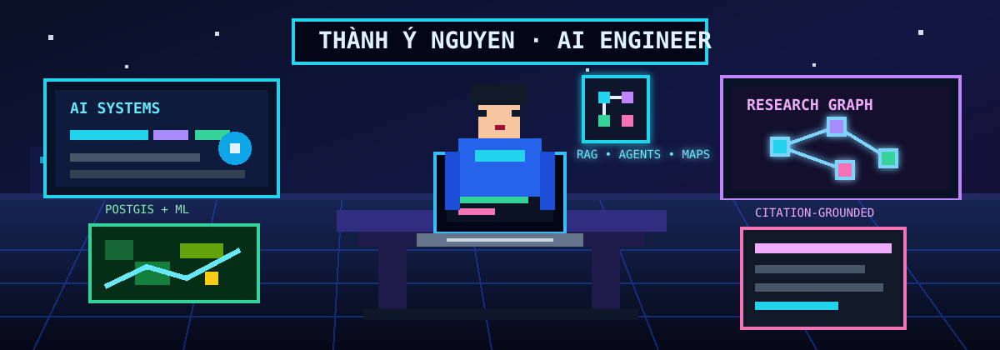

<div align="center">
  

  <h1>Thành Ý Nguyen</h1>

  <p>
    <b>AI Engineer · Full-Stack Developer · Research Builder</b><br />
    Building agentic AI, RAG systems, geospatial intelligence and production-ready web applications.
  </p>

  <p>
    <a href="mailto:ynguyenhk@gmail.com"></a>
    <a href="https://www.linkedin.com/in/thanh-y-nguyen-803a6726a/"></a>
    
  </p>
</div>


## About me

I build AI-assisted software that connects research, product engineering and real-world workflows. My work spans **agentic AI**, **retrieval-augmented generation**, **citation-grounded research tools**, **geospatial AI**, and **full-stack web systems**.

I care about systems that are useful beyond demos: clean UX, reliable APIs, searchable knowledge, explainable outputs, and practical deployment.

```txt
current focus  -> agentic AI · RAG · knowledge graphs · research tooling
engineering    -> Python · FastAPI · Django · React · TypeScript · PostgreSQL/PostGIS
ai/ml          -> LLM workflows · embeddings · ChromaDB · TensorFlow · scikit-learn · Gemini API
product style  -> evidence-first, privacy-aware, recruiter-readable, user-centered
```

## Featured work

### ResearchAI — Evidence-centered human-AI research environment
**Public repository:** [healerHK/ResearchAI](https://github.com/healerHK/ResearchAI)

ResearchAI is a Chrome Extension + FastAPI platform for researchers who want to write papers themselves while using AI to read, retrieve, verify, cite and organize evidence.

- Built a researcher-in-the-loop workflow for citation-grounded writing support.
- Implemented PDF ingestion, semantic search, citation recommendation and Obsidian knowledge-graph export.
- Added a supervisor-led agentic assistant for writing, citation, literature-review, structure and research-gap workflows.
- Stack: `FastAPI`, `React`, `TypeScript`, `ChromaDB`, `RAG`, `Obsidian`, `Gemini/OpenAI-compatible providers`.

### AI Agent Teaching Method Simulator — Generative-agent research prototype
**Private research project**

A simulation framework for evaluating teaching methods with virtual student and teacher agents before real-world classroom trials.

- Models classroom interactions between teacher agents and diverse student profiles.
- Supports instructional strategies such as flipped classroom, direct instruction, inquiry-based, project-based, problem-based, collaborative and game-based learning.
- Designed for repeatable analysis of learning gains, retention, misconception reduction, engagement and subgroup outcomes.
- Stack: `Python`, `agent simulation`, `statistical analysis`, `education AI`.

### CopperCoreAI — Geospatial AI / full-stack industry project
**Private company project · OreFox**

A professional geospatial AI web system built around spatial data workflows, PostGIS and ML-assisted analysis.

- Worked on a production-style Django/PostGIS application for geospatial data processing and AI-assisted insights.
- Integrated backend workflows, database setup, spatial extensions and ML/data-science dependencies.
- Strengthened experience with industry codebases, setup reproducibility, data-heavy systems and full-stack delivery.
- Stack: `Django`, `PostgreSQL`, `PostGIS`, `GeoPandas`, `Rasterio`, `Celery`, `scikit-learn`, `TensorFlow`.

> Source code is private because this was company work. I can discuss architecture, responsibilities and outcomes without exposing confidential implementation details.

### ts10_Healer — AI-powered admissions advisory platform
**Private company project · Tensoract**

An AI-assisted admissions and subject-combination advisory system for Vietnamese high-school students and school administrators.

- Built around student profile collection, subject-combination analysis and admissions-management workflows.
- Uses a web application architecture with Python backend services, HTML/JS frontend layers and Docker-based deployment.
- Focused on turning AI guidance into a practical school-facing product workflow.
- Stack: `Python`, `JavaScript`, `HTML/CSS`, `Docker`, `AI Q&A / advisory workflow`.

> Source code is private. The project is highlighted here only at product/architecture level.

### Cattle Farm Management System — Business operations web app
**Local/private project**

A Vietnamese cattle-farm operations system for inventory, cattle lots, finance, customer cota settlement, reporting and role-based workflows.

- Built a Dockerized full-stack app with Django REST Framework, PostgreSQL, React, TypeScript and PDF reporting.
- Designed around real business workflows: lot management, warehouse movement, finance records, dashboard/reporting and customer settlement.
- Focused on replacing spreadsheet-heavy processes with a maintainable internal web system.
- Stack: `Django`, `DRF`, `PostgreSQL`, `React`, `TypeScript`, `Docker`, `ReportLab`.

## Technical toolbox

<p>
  
  
  
  
  
  
  
  
  
  
  
  
</p>

## What I bring to a team

- **AI engineering mindset:** I can turn LLM/RAG/agentic concepts into working applications with APIs, data flow and UI.
- **Full-stack delivery:** I work across backend, frontend, databases, Docker and deployment-oriented project structure.
- **Research depth:** I like evidence, citations, knowledge graphs and systems that help people reason better.
- **Industry experience:** I have worked on private company projects where confidentiality, setup reliability and product workflow matter.
- **Builder energy:** I keep shipping personal systems, research prototypes and practical tools instead of only small tutorials.

## Confidentiality note

Some of my strongest work is in private repositories because it was built for companies, clients or sensitive business workflows. I do **not** publish confidential source code, credentials, datasets or internal implementation details. Public summaries focus on architecture, product value, stack and responsibilities.

<div align="center">
  
  <p><b>Open to AI engineering, full-stack development, research assistant and applied AI opportunities.</b></p>
</div>
